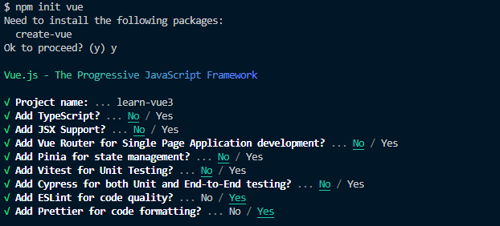

# 프로젝트 구성하기
Vue3에서는 VUe CLI는 유지관리 모드에 있기 때문에. 특정 웹팩 기능에 의존하지 않는한 Vite로 새프로젝트를 하는 것을 권장

## Vite
- 개발 서버를 구동할 때 매우 빠르다  
- 소스 코드의 변경이 일어났을 때 전체 모듈을 번들링 하는게 아니라 변경된 모듈만 교체한다.

## Vite로 프로젝트 생성 - [참고](https://gymcoding.notion.site/c14beecd6d584986bbb93d9a8fc74945)
  
- 생성 후 프로젝트 폴더로 이동 후 `npm install` 실행
- `npm install` 실행 후 `npm run dev` 실행